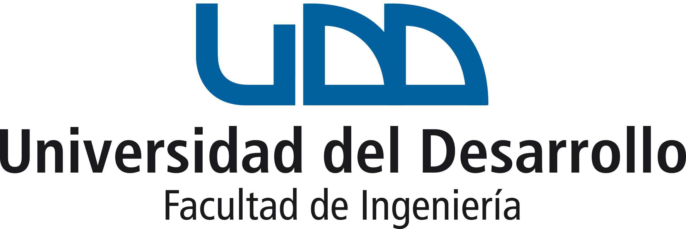

<div align="center">



# Optimización Aplicada a Negocios (IIP314W)

### Material del curso · Universidad del Desarrollo (UDD)

</div>

---

Este repositorio reúne todo el material docente del curso **Optimización Aplicada a Negocios (IIP314W)** de la Facultad de Ingeniería de la **Universidad del Desarrollo**. El curso aborda la teoría de optimización y su aplicación a problemas reales de negocios, combinando desarrollo matemático (modelamiento, resolución analítica y a mano) con implementación computacional en **Python**.

El objetivo de este repositorio es que **las y los estudiantes puedan revisar el material de trimestres anteriores** —ayudantías, clases y talleres— para estudiar, repasar y preparar evaluaciones.

- **Profesor:** Rodrigo Trigo Vilches
- **Ayudante:** Vicente Ramírez
- **Universidad:** Universidad del Desarrollo (UDD)

---

## 📚 Contenidos del curso

El curso recorre, de forma progresiva, los principales tópicos de optimización aplicada:

1. **Optimización sin restricciones**
   - Equivalencia entre máximos y mínimos.
   - Puntos críticos y su clasificación (criterio de la segunda derivada y Hessiano).
   - Descenso de gradiente (paso normalizado vs. no normalizado).
2. **Convexidad** y su rol para garantizar óptimos globales.
3. **Optimización con restricciones**
   - Multiplicadores de Lagrange (restricciones de igualdad) e interpretación del *precio sombra*.
   - Restricciones de desigualdad y región factible.
   - Condiciones de **Karush-Kuhn-Tucker (KKT)**.
4. **Modelamiento matemático** de problemas de negocio (LP / MIP).
   - Variables de activación, método de la **Gran M (Big M)**.
5. **Programación lineal y método Simplex**
   - Simplex estándar y con restricciones ≥ (Gran M).
   - Problema **dual**, simplex dual, holguras complementarias.
   - **Análisis de sensibilidad**.

---

## 🗂️ Estructura del repositorio

El material está organizado por trimestre (`AÑO-TX`, donde `T` es el trimestre). Cada trimestre contiene:

| Carpeta                              | Descripción                                                                                                  |
| ------------------------------------ | ------------------------------------------------------------------------------------------------------------- |
| `Clases/`                          | Notebooks de las clases dictadas por el**profesor**.                                                    |
| `Ayudantías/` (o `Ayudantía/`) | Notebooks/documentos de las ayudantías dictadas por el**ayudante**, aplicando la teoría a ejercicios. |
| `Talleres/` o `Tareas/`          | Enunciados de los trabajos prácticos (tareas/talleres).                                                      |
| `Recursos/`                        | Recursos de estudio (p. ej. archivos HTML por tema).                                                          |
| `Material anterior/`               | Material de apoyo heredado de trimestres previos.                                                             |

```
.
├── 2025-T2/
│   ├── Clases/           → Clases 1–11 (notebooks)
│   ├── Ayudantía/        → Ayudantías 1–9 (.ipynb / .pdf)
│   └── Talleres/         → Taller 1, 2, 3 (enunciados)
│
├── 2026-T1/
│   ├── Clases/           → Clases 1–25 (notebooks)
│   ├── Ayudantías/       → Ayudantías 1–9 (notebooks)
│   └── Tareas/           → Tarea 1, 2, 3, 4 (enunciados)
│
└── 2026-T2/   (trimestre en curso)
    ├── Clases/           → Clases del profesor
    ├── Ayudantías/       → Ayudantías del ayudante
    ├── Tareas/
    ├── Recursos/
    └── Material anterior/
```

---

## 🧭 Detalle por trimestre

### 2025-T2

| Tipo                  | Contenido principal                                                                                                                                      |
| --------------------- | -------------------------------------------------------------------------------------------------------------------------------------------------------- |
| **Clases**      | Equivalencia máx/mín · soluciones analíticas · ejercicios de optimización · condiciones KKT · modelamiento matemático.                          |
| **Ayudantías** | Gradiente descendente (dirección normalizada) · optimización con restricciones · KKT · modelamiento (varias en `.pdf` y material de certámenes). |
| **Talleres**    | Taller 1 (ayudantía aplicada), Taller 2 (tiempos de proceso, con generador de datos), Taller 3.                                                         |

### 2026-T1

| Tipo                  | Contenido principal                                                                                                                                                                                                                                                          |
| --------------------- | ---------------------------------------------------------------------------------------------------------------------------------------------------------------------------------------------------------------------------------------------------------------------------- |
| **Clases**      | 25 clases: desde puntos críticos y soluciones analíticas hasta prueba de optimalidad, primal/dual y simplex.                                                                                                                                                               |
| **Ayudantías** | 1. Repaso · 2. Puntos críticos · 3. KKT · 4. Modelamiento · 5. Big M y variables de activación · 6. Método Simplex · 7. Simplex con restricciones ≥ (Gran M) · 8. Dual, simplex dual, holguras complementarias y análisis de sensibilidad · 9. Repaso integral. |
| **Tareas**      | Tarea 1 (visualización de funciones), Tarea 2 (inventarios, con datos y generador), Tarea 3, Tarea 4 (formulación de modelo).                                                                                                                                              |

### 2026-T2 *(en curso)*

| Tipo                  | Contenido principal                                                                                        |
| --------------------- | ---------------------------------------------------------------------------------------------------------- |
| **Ayudantías** | 1. Puntos críticos y gradiente descendente · 2. Convexidad y optimización con restricciones (Lagrange). |
| **Clases**      | Equivalencia máx/mín · soluciones analíticas · ejercicios de optimización.                           |

---

## 🛠️ Tecnologías y librerías

El material computacional se desarrolla en **Python**, presentado en formato **Jupyter Notebook** (`.ipynb`), donde se combina el contexto del problema, el desarrollo matemático y la solución.

| Librería                            | Uso en el curso                                                                                                                      |
| ------------------------------------ | ------------------------------------------------------------------------------------------------------------------------------------ |
| **NumPy**                      | Operaciones numéricas.                                                                                                              |
| **pandas**                     | Manipulación de datos.                                                                                                              |
| **Matplotlib**                 | Visualización y gráficos.                                                                                                          |
| **SciPy** (`scipy.optimize`) | Problemas de optimización simples.                                                                                                  |
| **Gurobi** (`gurobipy`)      | Problemas de optimización complejos (LP/MIP); también para mostrar el uso de Gurobi en ejercicios ya resueltos a mano o con SciPy. |

> **Nota:** `gurobipy` requiere una licencia de Gurobi (existe licencia académica gratuita para estudiantes en [gurobi.com](https://www.gurobi.com/academia/academic-program-and-licenses/)).

### Cómo abrir el material

```bash
# Requisitos sugeridos
pip install numpy pandas matplotlib scipy gurobipy jupyter

# Abrir los notebooks
jupyter notebook
```

---

## ⚠️ Material no incluido en el repositorio

Para mantener el repositorio liviano y resguardar las soluciones, hay material que **no se publica aquí**:

- **Pautas de talleres y tareas:** las pautas (soluciones) de los talleres/tareas **no están incluidas** en el repositorio (ver `.gitignore`).
- **Archivos pesados (`.xlsx` y datos voluminosos):** los archivos Excel y bases de datos de gran tamaño **no se versionan**. Si necesitas alguno de estos archivos, **solicítalo directamente al ayudante** (Vicente Ramírez).

Si requieres material que no encuentras en el repositorio, escríbeme y te lo facilito según corresponda.

---

<div align="center">

*Optimización Aplicada a Negocios · IIP314W · Universidad del Desarrollo*

</div>
